# PROJECT 1 - INSTALLING APACHE AND UPDATING THE FIREWALL
`sudo apt update`
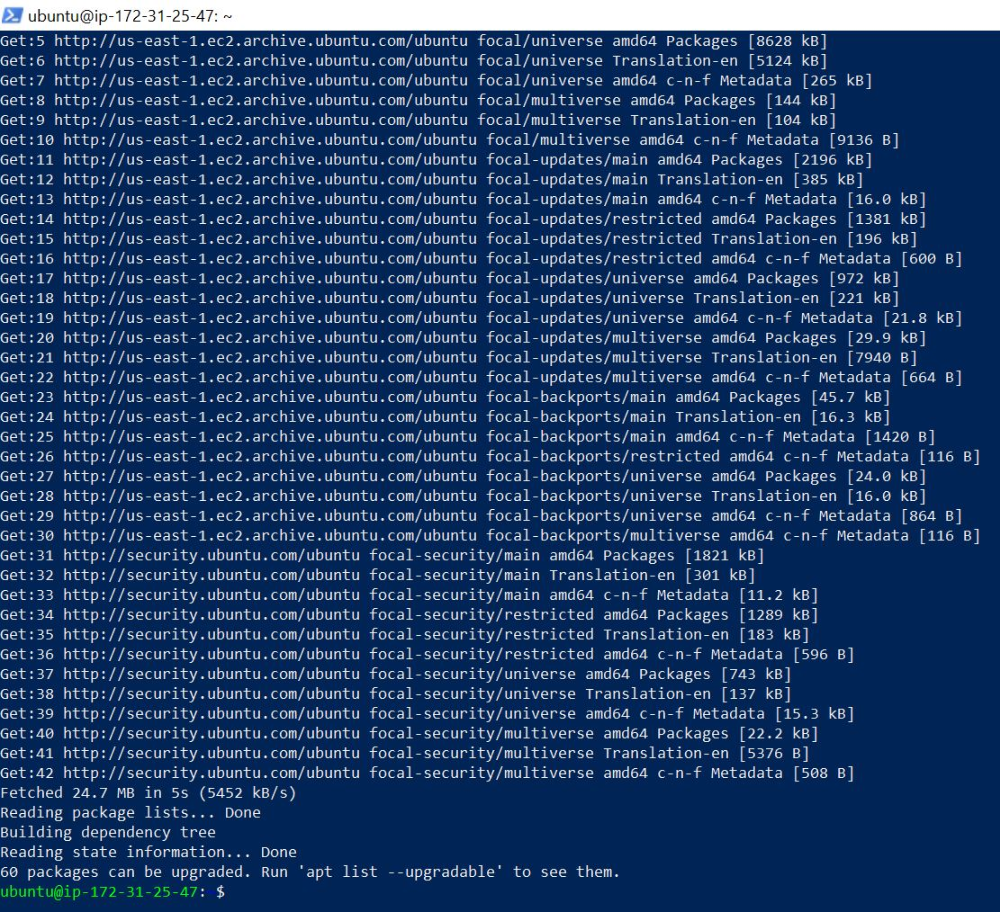
`sudo apt install apache2`
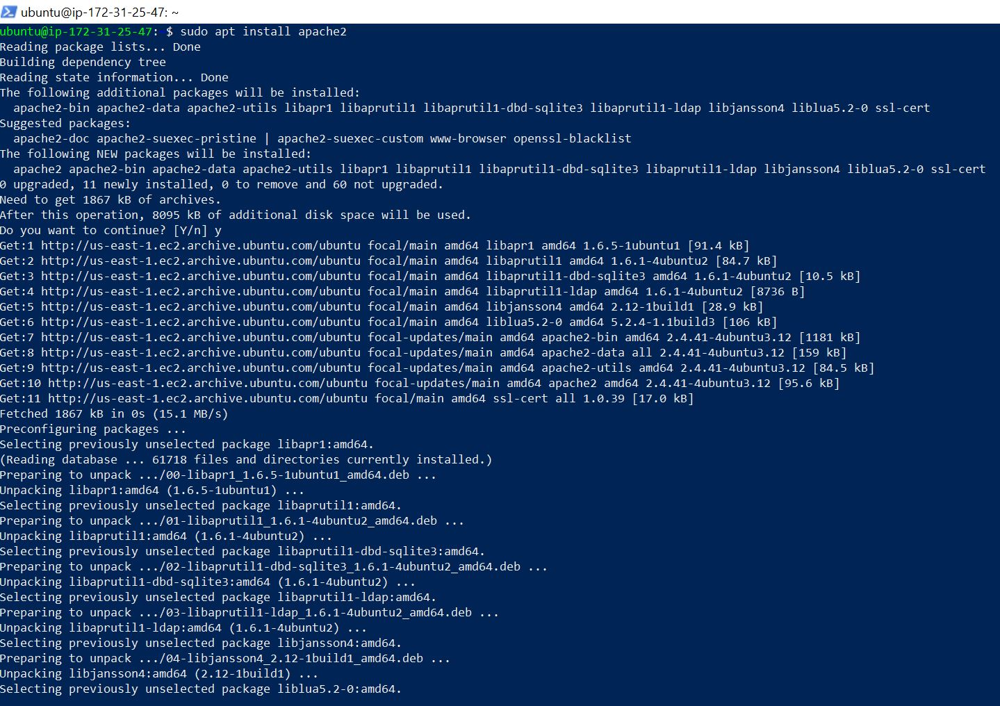
`sudo systemctl status apache2`
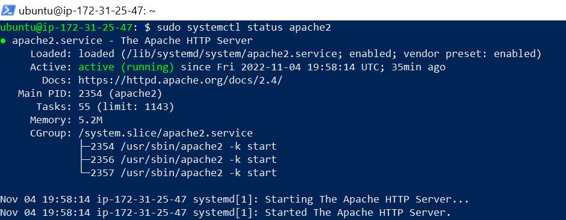

## Add a rule to EC2 configuration to open inbound connection through port 80
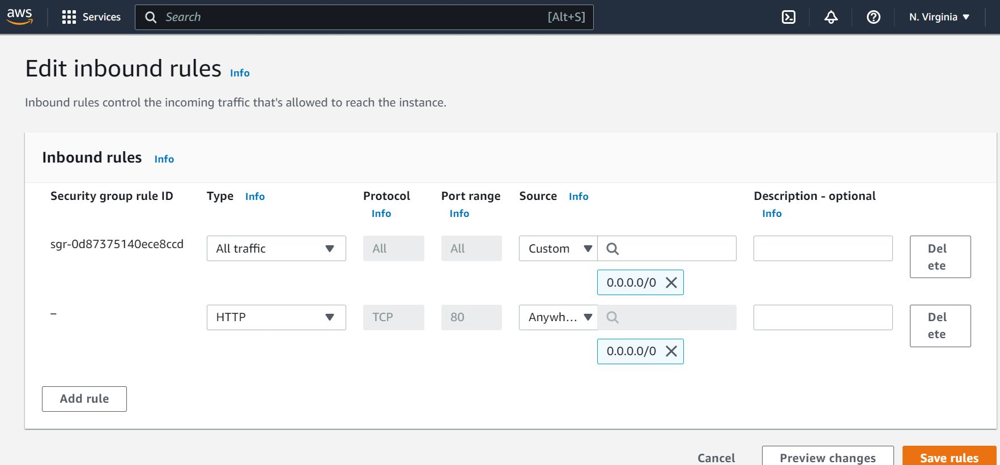
## Test to see if webserver responds to curl command
`curl http://localhost:80`
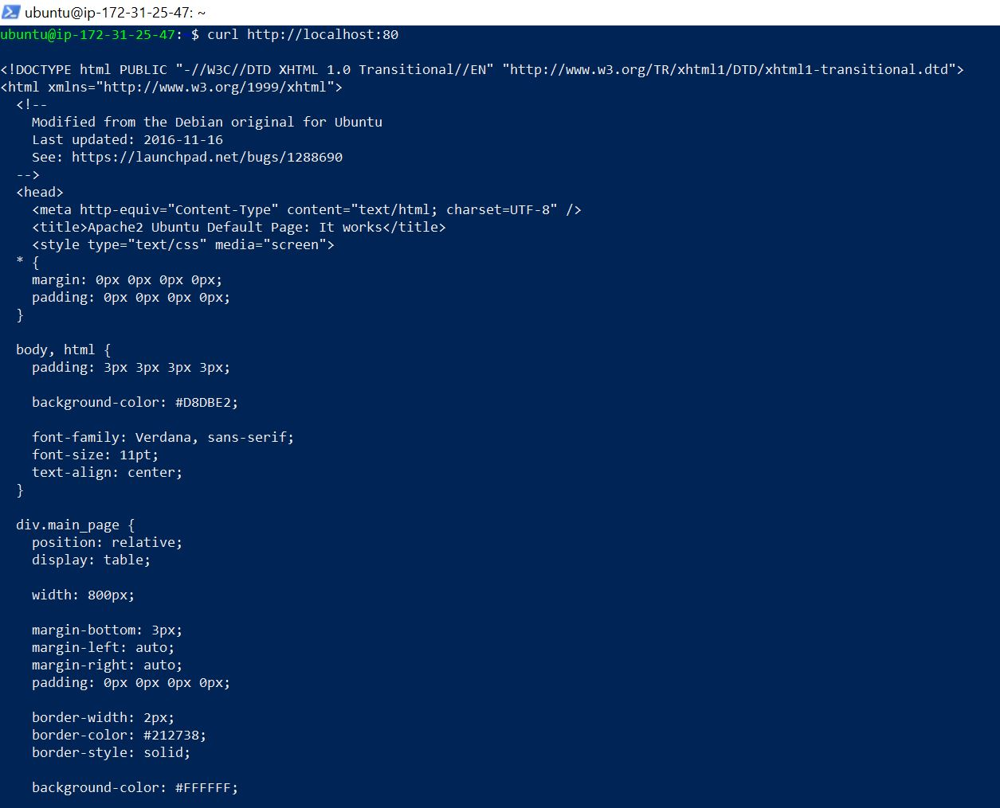
## Test on browser to see webserver responds
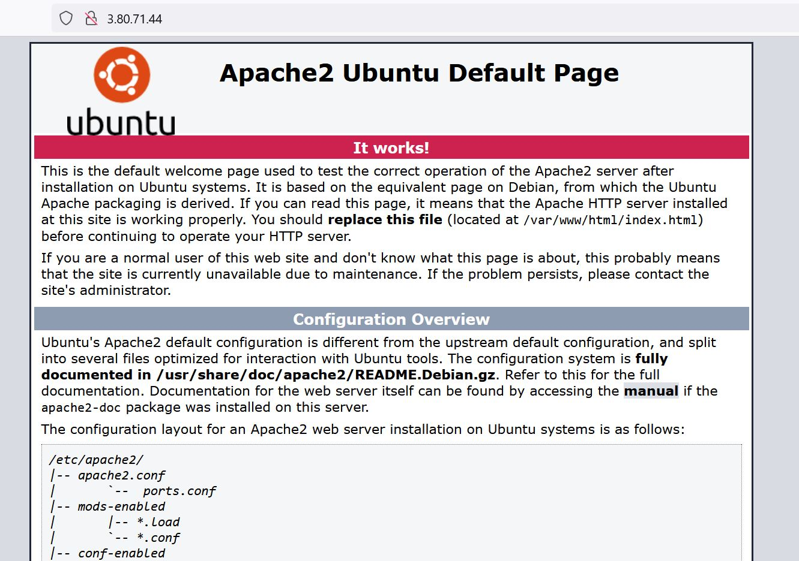

# PROJECT 1 - INSTALLING MYSQL
`sudo apt install mysql-server`
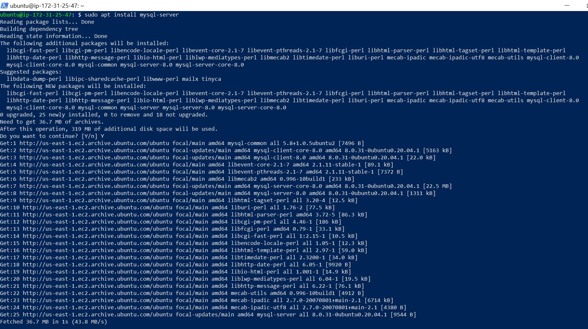
## Connect to mysql and secure root user password
`sudo mysql`
`ALTER USER 'root'@'localhost' IDENTIFIED WITH mysql_native_password BY 'PassWord.1';`
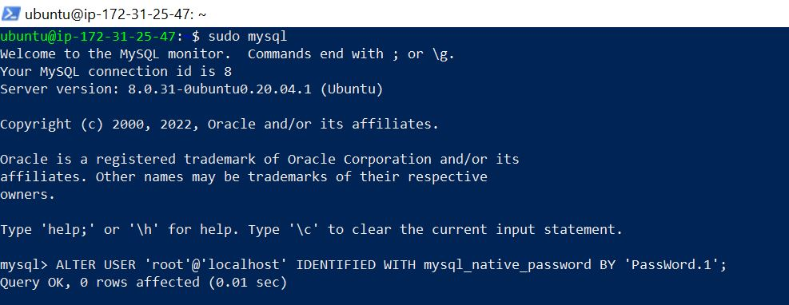

# PROJECT 1 - INSTALLING PHP
`sudo apt install php libapache2-mod-php php-mysql`
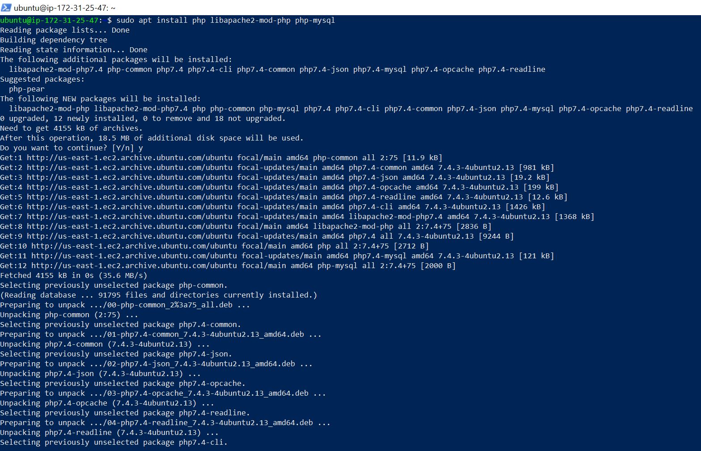

# PROJECT 1 - CREATING A VIRTUAL HOST FOR YOUR WEBSITE USING APACHE
`sudo mkdir /var/www/projectlamp`
`sudo chown -R $USER:$USER /var/www/projectlamp`
`sudo vi /etc/apache2/sites-available/projectlamp.conf`
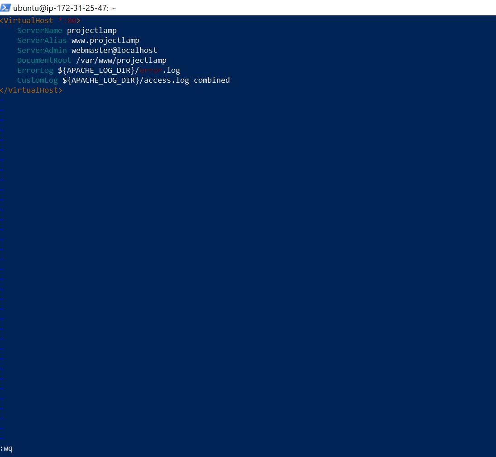
## Enable new virtual host and disable default apache website
`sudo a2ensite projectlamp`
`sudo a2dissite 000-default`
`sudo apache2ctl configtest`
## Reload Apache webserver for changes to take effect
`sudo systemctl reload apache2`
`sudo echo 'Hello LAMP from hostname' $(curl -s http://169.254.169.254/latest/meta-data/public-hostname) 'with public IP' $(curl -s http://169.254.169.254/latest/meta-data/public-ipv4) > /var/www/projectlamp/index.html`
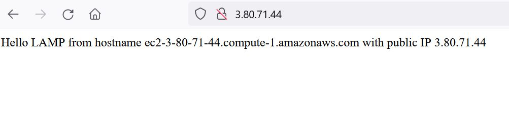

# PROJECT 1 - ENABLE PHP ON THE WEBSITE
`sudo vim /etc/apache2/mods-enabled/dir.conf`
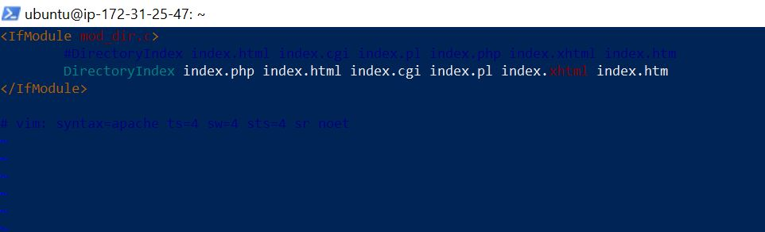
`sudo systemctl reload apache2`
## Create a new index.php file in the virtual directory
`vim /var/www/projectlamp/index.php`
` <?php phpinfo(); ` 
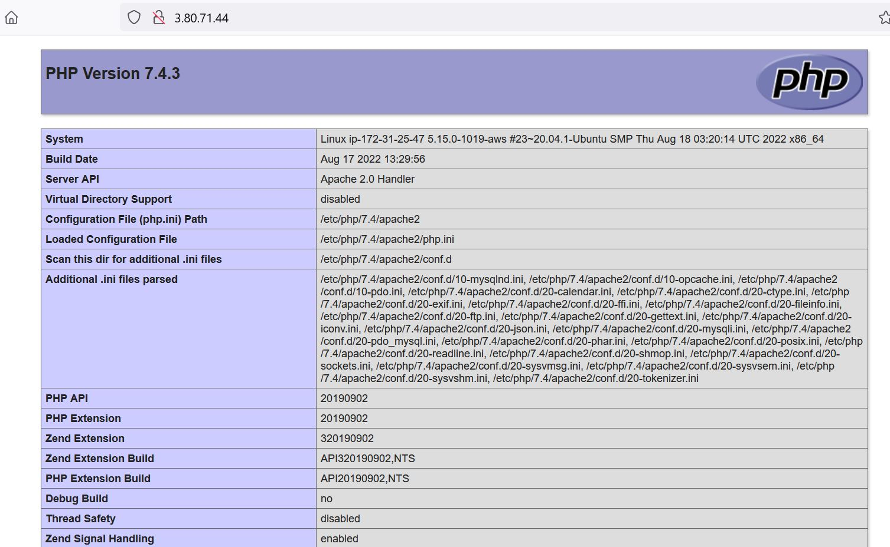
## Remove php test page because of sensitive information
`sudo rm /var/www/projectlamp/index.php`

# END OF PROJECT 1
